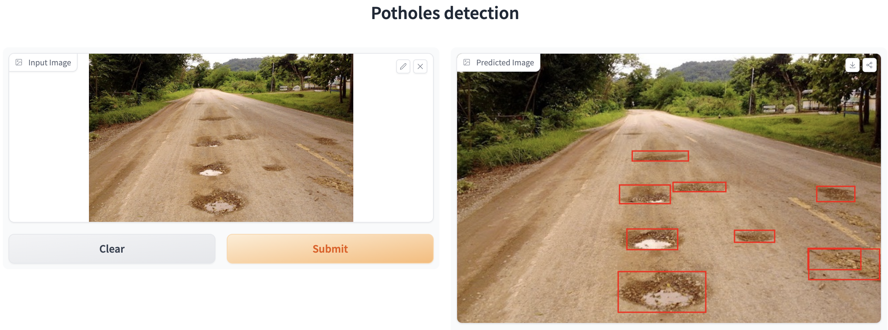

# LearnAI Potholes Detection

This is a crowdsource dataset and training script from LearnAI "Hands-on Deep Learning with Pytorch" on August 26, 2023.
We asked the participants to annotate the image and put together the dataset.
The original code can found at [`biodatlab/community-notebooks`](https://github.com/biodatlab/community-notebooks/tree/main/potholes-detection).

<p align="center">
  
</p>

## Model training

Running the notebook `yolo_potholes_addition.ipynb`. Upload `annotations.zip`, edit `data.yaml`, and run the notebook.

## Gradio application

Install dependecies

```sh
pip install gradio
pip install ultralytics
```

And run the application at the root of this repository.
It will read the trained model (`best.pt`) and create a Gradio application.

```sh
python app.py
```